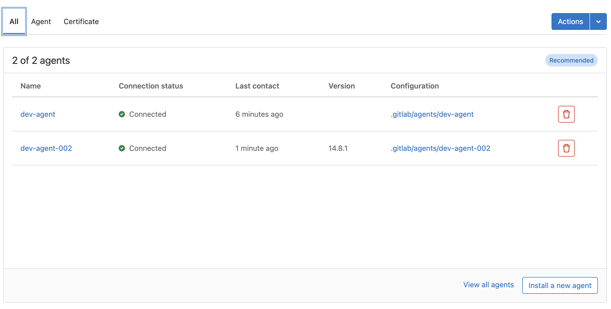

# Gitlab Agent

The Gitlab Agent, briefly put, provides a secure tunnel between our Gitlab installation and an EKS cluster, allowing for deployment of both internal and externally facing applications. Potential use cases include:

- Load-balanced, scalable backend microservices deployment in all environments
- Rapid builds, testing, and destroying CI/CD steps
- Maintenance and visibility into cluster health and security with the Agent configuration repository

Once configured, the Agent "watches" the manifest files of projects within Gitlab (as specified in the Agent's `config.yaml` file), and then executes the instructions in those manifest files, which will include deployment instructions. It is designed to deploy within the same cluster, although build and test tasks can also be defined in these manifests. In this way, there is some overlap between what the Gitlab Agent and the Gitlab Runner can do, and keeping the use cases of the two straight can be a challenge.

!!! note

    Keep this in mind: a repository's `.gitlab-ci.yml` file utilizes a Gitlab Runner, where as the Gitlab Agent looks for Kubernetes manifests in the target repository. Confusingly, you can provision a Gitlab Runner via the Gitlab Agent, but not vice versa - a standalone Gitlab Runner cannot do the same things a Gitlab Agent can do.

## The Gitlab Agent Configuration Repository

A specific repository in Gitlab provides the special use of administration for both the Agent(s) within our instance of Gitlab, but also the ability to quickly and easily install additional applications to verify the security and health of our EKS cluster. Find more information in [Gitlab's documentation](https://docs.gitlab.com/ee/user/clusters/agent/repository.html).

### Registering New Agents in Gitlab

You can register new agents in the cluster by adding a `config.yaml` file that matches the correct format in `./.gitlab/agents/name-of-agent/config.yaml` in the Gitlab Agent Configuration repository. It is not necessary to create new agents for each project or group, but there may be valid reasons to separate tasks between agents.

```
- .gitlab
  - agents
    - dev-agent
    - prod-agent
```

#### Example `config.yaml`

An absolute barebones `config.yaml` would include the following information. This defines a GitOps section, defines the repositories to watch, a namespace to run the task in, and the paths to look for manifest files in.

```
gitops:
  manifest_projects:
    - id: "example/path/to/config/"
      default_namespace: dev-agent-002
      paths:
        - glob: "/**/*.yaml"
```

#### Example Manifest File

This manifest file will go somewhere matching the `glob` pattern in the above `config.yaml` file, in the repository that matches the path in the `gitops.manifest_projects.id` section. This file does not need to be called `manifest.yaml`, but it DOES need to end in `.yaml` for the glob to match.

You can have one or several manifest files within the same project, and selectively execute them depending on your specifications.

!!! note

    If you have a manifest file in your repository, you can also have a `.gitlab-ci.yml`, or not. There is some overlap in terms of what they can do, but `.gitlab-ci.yml` has more visibility built in to the Gitlab GUI, but lacks the ability to securely connect with the Kubernetes cluster for deployment purposes. 

A manifest is a Kubernetes term for a set of instructions for actions/deployments within a Kubernetes Cluster. A trivial manifest file is shown below:

```
apiVersion: v1
kind: ConfigMap
metadata:
  name: gitlab-gitops-test
  namespace: default
data:
  key: It works!

```

(This manifest won't actually do anything besides apply a new ConfigMap to the cluster. More complex examples coming soon.)

# Create a Gitlab Agent

This article will guide you through creating and registering an instance of in a Kubernetes Cluster.

### Creating the Agent in Gitlab

The Gitlab Agent works by connecting your Gitlab installation with your Kubernetes Cluster. In order to do so, your Gitlab instance must be running something called [KAS](https://docs.gitlab.com/ee/administration/clusters/kas.html), or Kubernetes Agent Server. This is provided by default in Gitlab cloud hosted installations. The address of KAS for cloud hosted installations of Gitlab is `wss://kas.gitlab.com`. The cluster, meanwhile, needs to have software called `agentk` running in one or more pods.

After creating the new `config.yaml`, you can then let Gitlab know about the agent and receive an authorization token.

- In the Agent Configuration repository, click Infrastructure > Kubernetes clusters
- In the bottom right-hand corner of the agents box, click `Install a new agent`



- In the modal window that comes up, select your new agent out of the dropdown
- On the next screen, copy the token and store it somewhere temporarily

!!! warning

    This token is only available when you first visit this screen. There is no other way to acquire it, and if it is misplaced you will have to start over.


### Installing/Registering the Agent in the Kubernetes Cluster

This example assumes [Pulumi](pulumi.md) is being used to handle all of the cloud integrations (where possible) and this includes adding a new Gitlab Agent.

In order to add a new agent:

- Clone the [epository that provisions the clusters and delivers software into the cluster
- Add a new file in `lib/clusters` similar to `gitlab_agent.py`, with the name of the file being the name of the agent (e.g. `gitlab_prod_agent.py`)
- Add a reference to this agent in `eks.py`, similar to
  ```
    gitlab_prod_agent.compose_gitlab_agent(
        cluster_provider,
        cluster,
        account_info["gitlab_prod_agent_token"],
        account_name,
        )
  ```
    where `gitlab_prod_agent` is the file being imported.
- Encrypt the token you acquired from Gitlab in the previous step
- Assuming this agent is going to sit in the same cluster as the existing Gitlab agent(s), that encrypted token will sit alongside `agent_token` in the `Pulumi.administration.yaml` file, perhaps called `gitlab_prod_agent_token` - note this token is retrieved from the `account_info` object on the 4th line of the snippet above
- If you copied `gitlab_agent.py`, make sure to update the `namespace_name` and `agent_name` variables near the top of the file, or else the installation will fail

Now you're ready to register the new agent in the cluster. This Pulumi program will register a pod with `agentk` running on it, and then connect it to the Gitlab.


